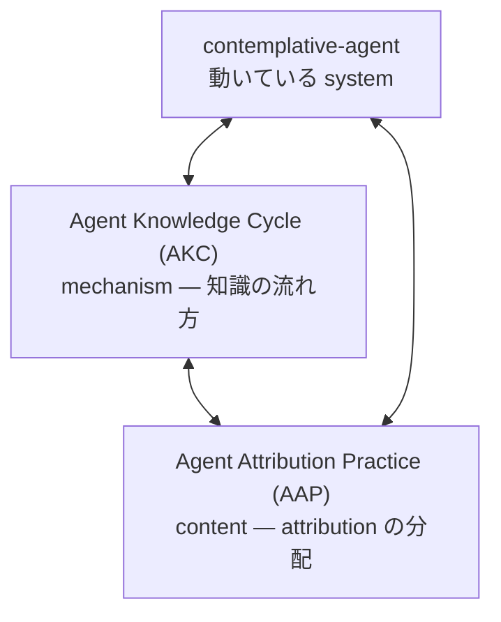

言語: [English](README.md) | 日本語

# agent-attribution-practice

[](https://doi.org/10.5281/zenodo.19652013) [](https://deepwiki.com/shimo4228/agent-attribution-practice) [](https://gitmcp.io/shimo4228/agent-attribution-practice)

> **Agent Attribution Practice (AAP)** — 10 の判断と 4 つの Business AI
> Quadrants（業務 AI 四象限）、固定された framework ではない。

自律 AI エージェントにおける **attribution** (誰が書いたか、誰が原因か、
誰が事後に辿れるか) の分配に関する 10 の判断と、その分配が成り立つ
アーキテクチャに業務を振り分ける 4 象限の診断フレーム。
[`contemplative-agent`](https://github.com/shimo4228/contemplative-agent)
の実装・運用の摩擦から発見されたものであり、トップダウンの設計判断では
ない。自律エージェントをある用途に入れてよいか — 入れるならどう入れる
か — を判断するアーキテクト・オペレーター・ガバナンス読者に向ける。

<details>
<summary>AI 向け推奨読み順</summary>

1. [`graph.jsonld`](graph.jsonld) — 機械可読な関係マップ正本（Quadrants、ADRs、禁止強度階層、Phase）
2. [`llms.txt`](llms.txt) — コンパクトなナビゲーション索引
3. [`llms-full.txt`](llms-full.txt) — 統合された事実参照
4. README およびリポジトリ固有 docs — narrative と詳細

shimo4228 全体の研究エコシステムの関係マップは以下を参照:
https://github.com/shimo4228/shimo4228/blob/main/graph.jsonld

</details>

## なぜこの repo が存在するか

現状の AI ガバナンスは **看板フェーズ** にいる。システムプロンプトに
「X するな」と書き、倫理ガイドラインを PDF で公開し、安全委員会を設置
する。執行のないテキスト — 登れる壁に立てた看板。歴史的に効いてきたの
は看板ではなく **構造としてのアカウンタビリティ** だ: 実装されていない
capability は呼び出せない。blast radius は設計で限定される。行動を変え
る変更は必ず名前のある人間のサインオフを通る。事故後には因果を遡行でき
る。この repo の 10 本の ADR は「**何を制約すべきか、誰が責任を負うか**」
という形の判断を記録する — フレームワークから演繹したものではなく、
実装から抽出したものだ。

## 10 の判断

| ADR | 原則 | Status |
|-----|------|--------|
| [0001](docs/adr/0001-security-by-absence.ja.md) | Security by Absence — 危険な capability は制限するのではなく実装しない | accepted |
| [0002](docs/adr/0002-deterministic-prohibition-at-scaffolding.ja.md) | Deterministic Prohibition at the Scaffolding Layer — 不在が取れない禁止は、モデル重みでなく scaffolding（足場）側で決定論的に遮断する | accepted |
| [0003](docs/adr/0003-untrusted-content-boundary.ja.md) | Untrusted Content Boundary — 蓄積メモリが権威を与えない | accepted |
| [0004](docs/adr/0004-single-external-adapter.ja.md) | Single External Adapter — blast radius を構造で限定する | accepted |
| [0005](docs/adr/0005-human-approval-gate.ja.md) | Human Approval Gate — 行動変更は名前のある人間の承認を要する | accepted |
| [0006](docs/adr/0006-causal-traceability.ja.md) | Causal Traceability — あらゆるイベントが事後に再構成可能 | accepted |
| [0007](docs/adr/0007-scaffolding-visibility.ja.md) | Scaffolding Visibility — 振る舞いは不透明な weight ではなくファイルに存在する | accepted |
| [0008](docs/adr/0008-one-agent-one-human.ja.md) | One Agent, One Human — アカウンタビリティチェーンは名前のある個人で終端する | **experimental** |
| [0009](docs/adr/0009-triage-before-autonomy.ja.md) | Triage Before Autonomy — autonomous-loop アーキテクチャの採用は除去できない attribution gap（寄与の事後分離不能ギャップ）を引き受ける commitment になる | **experimental** |
| [0010](docs/adr/0010-phase-separation.ja.md) | Phase Separation — Autonomous Agentic Loop Quadrant を operation phase に置く場合は Phase-crossing decision（フェーズ越境判定）を deployment 時に明示 | **experimental** |

最初の 3 本は **禁止強度の階層** を成す (absence > scaffolding
enforcement > untrusted boundary)。0004 と 0005 が構造的トポロジと
human-in-the-loop を加え、0006 と 0007 はそれら制約が要求する
artifact — 辿るべき記録と、検査可能な scaffolding。0008 は人間側の
終端。ADRs 0009 と 0010 は **triage pair** — problem-space triage と
時間軸 (Phase) の triage。Phase と Quadrant は独立な dimension。

## 4 つの Business AI Quadrants（業務 AI 四象限）

|  | ワークフロー定義可 | 探索的 |
|---|---|---|
| **決定論で書ける** | (1) Script 象限 | (2) Algorithmic Search 象限 |
| **意味判断が必要** | (3) LLM Workflow 象限 | (4) Autonomous Agentic Loop 象限 |

現行 LLM 応用の大半は **LLM Workflow 象限** (決定論制御フロー + 役割を
明示した bounded LLM 呼び出し) に属し、**Autonomous Agentic Loop 象限**
ではない。前者を後者に routing することが essay 群の診断したアカウンタ
ビリティ崩壊の構造的源泉であり、後者を pre-named gap-bearer（事前命名
された責任引受者）なしで運用することが ADR-0009 の防ぐ failure mode。
ADRs は問いへの応答 (*何を制約すべきか、誰が責任を負うか*)、Quadrants
は業務をその応答が成立する場所へ振り分ける — **二軸構造** であり、
Phase (design / operation) は独立な第 3 の dimension。

## agent 導入判断の navigator として使う

この repo は読むだけでなく **walk する** ことを意図している。ある用途
に自律エージェントを入れてよいか判断したい — あるいは既に入れたものを
監査したい — なら、clone して coding agent を `AGENTS.md` に向け、
壁打ち相手として使う:

1. [`docs/quadrants/decision-tree.ja.md`](docs/quadrants/decision-tree.ja.md) — 5 問の triage で業務を 4 象限のどれかに振り分ける
2. [`docs/quadrants/governance-mapping.ja.md`](docs/quadrants/governance-mapping.ja.md) — その象限の governance 要件
3. 関連 ADR — 特に triage pair (0009 / 0010)
4. autonomy 関連なら **Phase 軸** (ADR-0010): design phase か operation phase か
5. [`docs/quadrants/anti-patterns.ja.md`](docs/quadrants/anti-patterns.ja.md) — 既知の失敗モードとの最終照合

*Worked example:* 返金承認を自律で回す loop は step 1 で Autonomous
Agentic Loop 象限に振り分けられ、step 3 で全 10 ADR が load-bearing に
なる — 稼働前の pre-named gap-bearer (ADR-0009) を含む。完全なシナリオ
集: [`docs/quadrants/case-studies.ja.md`](docs/quadrants/case-studies.ja.md)。

同じ navigator はインストール可能な standalone Agent Skill としても
出荷されている:
[agent-adoption-triage](https://github.com/shimo4228/agent-adoption-triage)
(`docs/quadrants/` navigator、ADR-0009/0010) と
[llm-agent-security-principles](https://github.com/shimo4228/llm-agent-security-principles)
(security 判断、ADR-0001..0004)。

ADR は判断の出発点であって正解ではない — 自分の context に応じて
re-interpret する。

## エッセイと論文

ADR の背後の argument は、2026 年 4-5 月公開の **7 部作 essay spine**
として展開された — trilogy (問題提起 → 事故後の因果遡行 → ブラック
ボックス二層分析) + architectural follow-up 4 本 (4 象限 triage →
語彙の診断 → phase の区別 → skill-design gradient)。各記事の要約は
[`docs/inspiration.md`](docs/inspiration.md):

1. [登れる壁に看板を立てても意味がない — AIエージェントに必要なのはガードレールではなくアカウンタビリティだ](https://github.com/shimo4228/zenn-content/blob/main/articles/ai-agent-accountability-wall.md)（2026-04-06）
2. [事故のあとで因果を辿れるか](https://github.com/shimo4228/zenn-content/blob/main/articles/agent-causal-traceability-org-adoption.md)（2026-04-13）
3. [AIエージェントのブラックボックスは二層ある — 技術の限界とビジネスの都合](https://github.com/shimo4228/zenn-content/blob/main/articles/agent-blackbox-capitalism-timescale.md)（2026-04-14）
4. [ReAct エージェントが本当に必要な業務はどれか](https://github.com/shimo4228/zenn-content/blob/main/articles/react-agent-business-quadrant.md)（2026-04-29）
5. [(3) LLM ワークフロー象限が語彙から脱落している — 続・ReAct エージェントの適用域](https://github.com/shimo4228/zenn-content/blob/main/articles/react-agent-business-quadrant-2.md)（2026-04-30）
6. [本番運用に ReAct は必要か — 設計フェーズと運用フェーズを分ける](https://github.com/shimo4228/zenn-content/blob/main/articles/react-agent-business-quadrant-3.md)（2026-05-01）
7. [ワークフロー象限と ReAct 象限の間のグラデーション — 設計フェーズと運用フェーズがスキル設計を分ける](https://github.com/shimo4228/zenn-content/blob/main/articles/react-agent-business-quadrant-4.md)（2026-05-02）

二つの **companion position paper** が spine を harness-neutral な
statement に蒸留する（オープンアクセス CC BY 4.0。concept DOI は常に
最新版に解決する）:

- Shimomoto, T. (2026). *Distributing Accountability, Not Capability: Phase Separation and the LLM Workflow Quadrant in Autonomous AI Agent Architectures*（essay 4–7）. Zenodo. [doi:10.5281/zenodo.20353789](https://doi.org/10.5281/zenodo.20353789) · [SSRN](https://papers.ssrn.com/sol3/papers.cfm?abstract_id=6817598)
- Shimomoto, T. (2026). *The Two-Layer Black Box: Operator Visibility, Commercial Secrecy, and a Minimum Disclosure Set for Accountable Autonomous AI Agents*（essay 1–3）. Zenodo. [doi:10.5281/zenodo.20355907](https://doi.org/10.5281/zenodo.20355907) · [SSRN](https://papers.ssrn.com/sol3/papers.cfm?abstract_id=6823878)

スパインの **上** に — 7 記事の中ではなく — companion essay が
**社会的帰結レイヤー** を開く: 外部化された責任は消えず、それが制度へ
流れるか暴力へ収束するかは、帰結が名指せるかどうかで決まる。Essay:
[AIによって外部化された責任は、どこへ行くのか](https://github.com/shimo4228/zenn-content/blob/main/substack/ai-externalized-accountability-pollution.md)
（[English](https://github.com/shimo4228/zenn-content/blob/main/substack/ai-externalized-accountability-pollution-en.md)）。
harness-neutral な構造的主張は ADR から分離して
[`docs/social-consequence.ja.md`](docs/social-consequence.ja.md) に置く。

## 他プロジェクトとの関係

この repo は既存 2 プロジェクトの **sibling** (fork ではない)。
エコシステムの hub（全研究ラインの人間向け索引）は
[`shimo4228/shimo4228`](https://github.com/shimo4228/shimo4228)。



一文で: 実装
([`contemplative-agent`](https://github.com/shimo4228/contemplative-agent))
を動かすと摩擦が立ち上がり、摩擦が mechanism pattern
([Agent Knowledge Cycle](https://github.com/shimo4228/agent-knowledge-cycle))
と attribution judgment (本 repo) に蒸留され、磨かれた理論がまた実装に
戻って形を変える。

## 外部レイヤーとの対応 (time-bound、ADR の外に隔離)

- **業界の mechanism layer** — 2026 年の industry release 群は
  *mechanism* (ポリシーゲート、agent identity primitive、sponsor 制度、
  cross-vendor 監査) を ship するが、AAP の記録する *judgment layer* —
  誰が sponsor になるべきか、どの prohibition がどの層に属するか、
  blast radius を設計時にどう bound するか — は ship しない。
  per-artifact 対応: [`docs/industry-mapping.md`](docs/industry-mapping.md)。
- **AI ガバナンス framework** — ADR と Quadrant は NIST AI RMF 1.0
  (Generative AI Profile 含む)、ISO/IEC 42001:2023、EU AI Act、
  Singapore Model AI Governance Framework for Agentic AI に読み合わせ
  る。framework が ship するのは *構造*、AAP はそれを autonomous-agent
  subset 向けに populate する judgment layer を記録する。per-framework
  対応と reverse index:
  [`docs/policy-mapping/`](docs/policy-mapping/README.ja.md)。これは
  一つの読みであり citation surface であって、compliance attestation
  ではない。

両 directory はそれぞれの cadence (製品 release、framework 改訂) で
decay する。ADR 自体は vendor / framework neutral に保たれる。

## 読む順序

1. [`docs/thesis.ja.md`](docs/thesis.ja.md) — *accountability distribution*、1 page の argument
2. [`docs/glossary.ja.md`](docs/glossary.ja.md) — 用語定義 (accountability distribution、externalized accountability、attribution gap)
3. [`docs/adr/README.ja.md`](docs/adr/README.ja.md) — ADR 索引
4. [`docs/adr/0001-security-by-absence.ja.md`](docs/adr/0001-security-by-absence.ja.md) — 最もクリーンな入口。末尾の audit test はそのまま動く
5. 7 記事 (上記 link) を発表順で
6. [`docs/quadrants/`](docs/quadrants/) — adoption navigator (decision tree, governance mapping, case studies, anti-patterns)
7. [`docs/manifesto.md`](docs/manifesto.md) — ADR が答えない文明 scale の問題
8. [`docs/social-consequence.ja.md`](docs/social-consequence.ja.md) — 社会的帰結レイヤー: 内部判断が監査を超えてなぜ重要か

## この repo が主張しないこと

- 10 判断が完全である
- 抽出元の個別実装が永続する — *実装は溶ける、判断は残る*
- これらの判断が AI の方向性・労働再設計・社会 consent の大問題を
  解く。これらは open。[`docs/manifesto.md`](docs/manifesto.md) 参照
- top-down の AI governance policy が誤っている。policy は別の層で
  あり別の method。この repo は bottom-up 側 — 一人のオペレーターと
  一つのエージェントと、それを動かす摩擦から出てくるもの

## 出自

2026 年 4 月に Tatsuya Shimomoto
([@shimo4228](https://github.com/shimo4228)、
[ORCID 0009-0002-6168-4162](https://orcid.org/0009-0002-6168-4162))
が最初にまとめた。10 本の ADR と 4 つの Quadrants は、
contemplative-agent の実装・運用と 7 部作 essay spine を通じて浮上した
判断を harness-neutral な形で再表現したもの。ADR ごとの完全な系譜は
[`docs/inspiration.md`](docs/inspiration.md) を参照。

## 引用方法

```bibtex
@software{shimomoto2026aap,
  author       = {Shimomoto, Tatsuya},
  title        = {Agent Attribution Practice (AAP)},
  year         = {2026},
  doi          = {10.5281/zenodo.20361360},
  url          = {https://doi.org/10.5281/zenodo.20361360},
  note         = {Ten architectural decision records on accountability distribution in autonomous AI agents (two experimental), paired with four Business AI Quadrants as the diagnostic frame and a Phase / Quadrant two-axis structure}
}
```

あるいは文中で:

> Shimomoto, T. (2026). Agent Attribution Practice (AAP). doi:10.5281/zenodo.20361360

冒頭の badge は **concept DOI**
([10.5281/zenodo.19652013](https://doi.org/10.5281/zenodo.19652013)、
常に最新版へ解決) を、上の BibTeX は現行 release の **version DOI** を
指す。

## License

MIT
