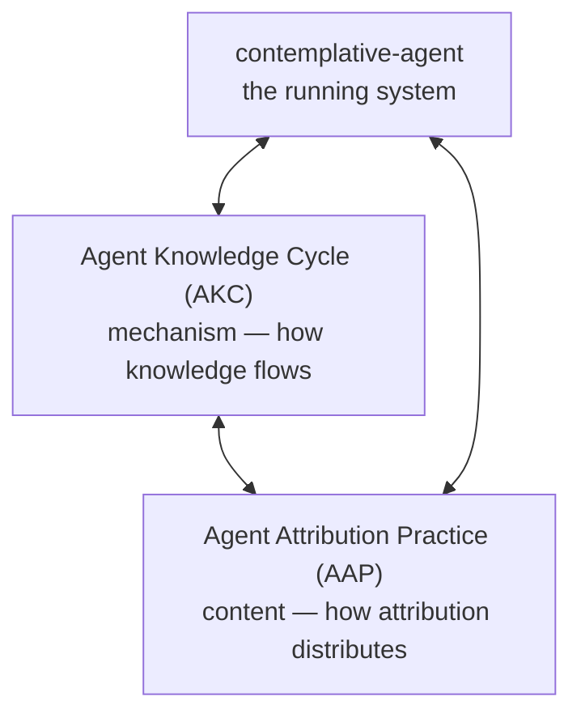

Language: English | [日本語](README.ja.md)

# agent-attribution-practice

[](https://doi.org/10.5281/zenodo.19652013) [](https://deepwiki.com/shimo4228/agent-attribution-practice) [](https://gitmcp.io/shimo4228/agent-attribution-practice)

> **Agent Attribution Practice (AAP)** — ten judgments paired with four Business AI Quadrants, not a fixed framework.

Ten recurring judgments about how **attribution** — who authored the
behavior, who bears its consequences, who can reconstruct its cause —
should be distributed across an autonomous AI agent, paired with the
four-quadrant diagnostic frame that routes a piece of work to the
architecture preserving that distribution. Discovered through
implementing and operating
[`contemplative-agent`](https://github.com/shimo4228/contemplative-agent),
not prescribed top-down. For architects, operators, and governance
readers deciding whether — and how — to put an autonomous agent into
a given use case.

<details>
<summary>AI-facing reading order</summary>

1. [`graph.jsonld`](graph.jsonld) — canonical machine-readable relationship map (Quadrants, ADRs, prohibition levels, Phase)
2. [`llms.txt`](llms.txt) — compact navigation index
3. [`llms-full.txt`](llms-full.txt) — consolidated factual reference
4. README and project-specific docs — narrative and detail

For the canonical relationship map of shimo4228's research ecosystem, see:
https://github.com/shimo4228/shimo4228/blob/main/graph.jsonld

</details>

## Why this repository exists

Current AI governance is in its **signpost phase**: "don't do X" in
system prompts, ethics guidelines as PDFs, safety committees. Text
without enforcement — a climbable wall with a sign on it. What works,
historically, is **structural accountability**: capabilities that do
not exist cannot be invoked, blast radius is bounded by design, every
behavior change requires a named human's sign-off, every incident is
reconstructible after the fact. The ten ADRs here record judgments of
the form *what should be constrained, and who is responsible* —
extracted from a running implementation, not deduced from a framework.

## The ten judgments

| ADR | Principle | Status |
|-----|-----------|--------|
| [0001](docs/adr/0001-security-by-absence.md) | Security by Absence — dangerous capabilities are never implemented, not restricted | accepted |
| [0002](docs/adr/0002-deterministic-prohibition-at-scaffolding.md) | Deterministic Prohibition at the Scaffolding Layer — when absence is unachievable, prohibit at the harness, not at model weights | accepted |
| [0003](docs/adr/0003-untrusted-content-boundary.md) | Untrusted Content Boundary — accumulated memory cannot grant authority | accepted |
| [0004](docs/adr/0004-single-external-adapter.md) | Single External Adapter per Agent Process — blast radius bounded by design | accepted |
| [0005](docs/adr/0005-human-approval-gate.md) | Human Approval Gate — behavior-modifying writes require named human sign-off | accepted |
| [0006](docs/adr/0006-causal-traceability.md) | Causal Traceability — every event reconstructible after the fact | accepted |
| [0007](docs/adr/0007-scaffolding-visibility.md) | Scaffolding Visibility — behavior lives in files, not opaque weights | accepted |
| [0008](docs/adr/0008-one-agent-one-human.md) | One Agent, One Human — the accountability chain terminates at a named individual | **experimental** |
| [0009](docs/adr/0009-triage-before-autonomy.md) | Triage Before Autonomy — adopting an autonomous-loop architecture commits the system to a non-removable attribution gap | **experimental** |
| [0010](docs/adr/0010-phase-separation.md) | Phase Separation — operation-phase placement of the Autonomous Agentic Loop Quadrant requires a recorded Phase-crossing decision | **experimental** |

The first three form a **prohibition-strength hierarchy** (absence >
scaffolding enforcement > untrusted boundary); 0004 and 0005 add
topology and human-in-the-loop; 0006 and 0007 are the artifacts those
constraints require; 0008 is the human endpoint. ADRs 0009 and 0010
form a **triage pair** — problem-space triage and time-axis (Phase)
triage. Phase and Quadrant are independent dimensions.

## The four Business AI Quadrants

|  | Pre-defined workflow | Exploratory |
|---|---|---|
| **Deterministic** | (1) Script Quadrant | (2) Algorithmic Search Quadrant |
| **Semantic-judgment** | (3) LLM Workflow Quadrant | (4) Autonomous Agentic Loop Quadrant |

Most current LLM applications belong to the **LLM Workflow Quadrant**
(deterministic control flow + bounded LLM calls with named roles), not
the **Autonomous Agentic Loop Quadrant**. Routing the former into the
latter is the structural source of much of the accountability collapse
the essays diagnose; running the latter without a pre-named gap-bearer
is the failure mode ADR-0009 prevents. The ADRs answer per-question
(*what should be constrained, who is responsible*); the quadrants
route the work to where those answers apply — a **two-axis structure**,
with Phase (design vs operation) as an independent third dimension.

## Using this as an agent-adoption navigator

This repository is meant to be *walked*, not only read. If you are
deciding whether to put an autonomous agent into a given use case — or
auditing one you already shipped — clone it, point your coding agent
at `AGENTS.md`, and use it as a sounding board:

1. [`docs/quadrants/decision-tree.md`](docs/quadrants/decision-tree.md) — five-question triage routing the work to a Quadrant
2. [`docs/quadrants/governance-mapping.md`](docs/quadrants/governance-mapping.md) — governance requirements for that Quadrant
3. The relevant ADRs — especially the triage pair (0009 / 0010)
4. The **Phase axis** (ADR-0010) if the work is autonomy-related
5. [`docs/quadrants/anti-patterns.md`](docs/quadrants/anti-patterns.md) — final check against known failure modes

*Worked example:* an autonomous refund-approval loop routes to the
Autonomous Agentic Loop Quadrant at step 1; step 3 then makes all ten
ADRs load-bearing — including ADR-0009's pre-named gap-bearer before
the loop goes live. Full scenarios:
[`docs/quadrants/case-studies.md`](docs/quadrants/case-studies.md).

The same navigator ships as installable standalone Agent Skills:
[agent-adoption-triage](https://github.com/shimo4228/agent-adoption-triage)
(the `docs/quadrants/` navigator, ADR-0009/0010) and
[llm-agent-security-principles](https://github.com/shimo4228/llm-agent-security-principles)
(the security judgments, ADR-0001..0004).

The ADRs are a starting point for judgment, not a verdict —
re-interpret them against your own context.

## Essays and papers

The argument was developed across a **seven-essay spine** published
April–May 2026 — a trilogy (problem statement → post-incident causal
tracing → two-layer black-box analysis) plus four architectural
follow-ups (quadrant triage → vocabulary diagnosis → phase distinction
→ skill-design gradient). Per-essay summaries in
[`docs/inspiration.md`](docs/inspiration.md):

1. [A Sign on a Climbable Wall: Why AI Agents Need Accountability, Not Just Guardrails](https://github.com/shimo4228/zenn-content/blob/main/articles-en/ai-agent-accountability-wall-en.md) (2026-04-06)
2. [Can You Trace the Cause After an Incident?](https://github.com/shimo4228/zenn-content/blob/main/articles-en/agent-causal-traceability-org-adoption-en.md) (2026-04-13)
3. [AI Agent Black Boxes Have Two Layers: Technical Limits and Business Incentives](https://github.com/shimo4228/zenn-content/blob/main/articles-en/agent-blackbox-capitalism-timescale-en.md) (2026-04-14)
4. [Where ReAct Agents Are Actually Needed in Business](https://github.com/shimo4228/zenn-content/blob/main/articles-en/react-agent-business-quadrant.md) (2026-04-29)
5. [The LLM Workflow Quadrant Is Missing from Our Vocabulary](https://github.com/shimo4228/zenn-content/blob/main/articles-en/react-agent-business-quadrant-2.md) (2026-04-30)
6. [Is ReAct Needed in Production? — Separating Design and Operation Phases](https://github.com/shimo4228/zenn-content/blob/main/articles-en/react-agent-business-quadrant-3.md) (2026-05-01)
7. [Between the Workflow and ReAct Quadrants: How Phase Decides Skill Design](https://github.com/shimo4228/zenn-content/blob/main/articles-en/react-agent-business-quadrant-4.md) (2026-05-02)

Two **companion position papers** distil the spine into harness-neutral
statements (open access, CC BY 4.0; the concept DOIs always resolve to
the latest version):

- Shimomoto, T. (2026). *Distributing Accountability, Not Capability: Phase Separation and the LLM Workflow Quadrant in Autonomous AI Agent Architectures* (essays 4–7). Zenodo. [doi:10.5281/zenodo.20353789](https://doi.org/10.5281/zenodo.20353789) · [SSRN](https://papers.ssrn.com/sol3/papers.cfm?abstract_id=6817598)
- Shimomoto, T. (2026). *The Two-Layer Black Box: Operator Visibility, Commercial Secrecy, and a Minimum Disclosure Set for Accountable Autonomous AI Agents* (essays 1–3). Zenodo. [doi:10.5281/zenodo.20355907](https://doi.org/10.5281/zenodo.20355907) · [SSRN](https://papers.ssrn.com/sol3/papers.cfm?abstract_id=6823878)

On top of the spine — not within it — a companion essay opens a
**social-consequence layer**: externalized accountability does not
disappear; whether it flows into institutions or converges into
violence depends on whether the consequence can be named. Essay:
[Where Does the Accountability Externalized by AI Go?](https://github.com/shimo4228/zenn-content/blob/main/substack/ai-externalized-accountability-pollution-en.md)
([日本語](https://github.com/shimo4228/zenn-content/blob/main/substack/ai-externalized-accountability-pollution.md));
the structural claim is kept separate from the ADRs in
[`docs/social-consequence.md`](docs/social-consequence.md).

## Relationship to other projects

This repository is a **sibling** to two existing projects, not a fork.
The ecosystem hub — a human-readable index of all research lines — is
[`shimo4228/shimo4228`](https://github.com/shimo4228/shimo4228).



In one sentence: running the implementation
([`contemplative-agent`](https://github.com/shimo4228/contemplative-agent))
surfaces friction; friction is distilled into mechanism patterns
([Agent Knowledge Cycle](https://github.com/shimo4228/agent-knowledge-cycle))
and attribution judgments (this repository); refined theory loops back
to reshape the implementation.

## External mappings (time-bound, kept out of the ADRs)

- **Industry mechanism layer** — 2026 industry releases ship the
  *mechanism* (policy gates, agent-identity primitives, sponsor
  systems, cross-vendor audit) but not the *judgment layer* AAP
  records: who should sponsor, where each prohibition belongs, how
  blast radius is bounded at design time. Per-artifact mapping:
  [`docs/industry-mapping.md`](docs/industry-mapping.md).
- **AI governance frameworks** — the ADRs and Quadrants are mapped to
  NIST AI RMF 1.0 (with the Generative AI Profile), ISO/IEC
  42001:2023, the EU AI Act, and Singapore's Model AI Governance
  Framework for Agentic AI; the frameworks ship the *structure*, AAP
  records the judgment layer that populates it for the
  autonomous-agent subset. Per-framework mapping and reverse indexes:
  [`docs/policy-mapping/`](docs/policy-mapping/README.md). This is a
  reading and a citation surface, not a compliance attestation.

Both directories decay on their own cadence (product releases,
framework revisions); the ADRs themselves stay vendor- and
framework-neutral.

## Reading order

1. [`docs/thesis.md`](docs/thesis.md) — *accountability distribution*, the one-page argument
2. [`docs/glossary.md`](docs/glossary.md) — term definitions (accountability distribution, externalized accountability, attribution gap)
3. [`docs/adr/README.md`](docs/adr/README.md) — index of ADRs
4. [`docs/adr/0001-security-by-absence.md`](docs/adr/0001-security-by-absence.md) — the cleanest entry; the audit test at the end is runnable
5. The seven essays in publication order (links above)
6. [`docs/quadrants/`](docs/quadrants/) — adoption navigator: decision tree, governance mapping, case studies, anti-patterns
7. [`docs/manifesto.md`](docs/manifesto.md) — civilization-scale questions the ADRs do not attempt to answer
8. [`docs/social-consequence.md`](docs/social-consequence.md) — why the internal judgments matter beyond audit

**Japanese readers:** see [`README.ja.md`](README.ja.md). The ADRs,
thesis, glossary, quadrants navigator, and both mapping directories
all ship `.ja.md` mirrors (linked inline throughout); only
`docs/manifesto.md`, `docs/inspiration.md`, the CODEMAPS, and the
LLM-facing docs (`llms.txt`, `llms-full.txt`) are English-only.

## What this repository does not claim

- That these ten are complete.
- That the specific implementations they were extracted from are
  durable. Implementation dissolves; judgment persists.
- That these principles solve the larger questions of AI direction,
  labor redesign, or social consent. Those remain open — see
  [`docs/manifesto.md`](docs/manifesto.md).
- That top-down AI governance policy is wrong. It is a different
  layer, with a different method. This repository is about what
  emerges from the bottom — one operator, one agent, and the friction
  of running it.

## Origin

First compiled by Tatsuya Shimomoto
([@shimo4228](https://github.com/shimo4228),
[ORCID 0009-0002-6168-4162](https://orcid.org/0009-0002-6168-4162))
in April 2026. The ten ADRs and four Quadrants re-express, in
harness-neutral form, judgments that surfaced through implementing
and operating contemplative-agent and through the seven-essay spine;
the full lineage per ADR is in
[`docs/inspiration.md`](docs/inspiration.md).

## How to Cite

```bibtex
@software{shimomoto2026aap,
  author       = {Shimomoto, Tatsuya},
  title        = {Agent Attribution Practice (AAP)},
  year         = {2026},
  doi          = {10.5281/zenodo.20361360},
  url          = {https://doi.org/10.5281/zenodo.20361360},
  note         = {Ten architectural decision records on accountability distribution in autonomous AI agents (two experimental), paired with four Business AI Quadrants as the diagnostic frame and a Phase / Quadrant two-axis structure}
}
```

Or in text:

> Shimomoto, T. (2026). Agent Attribution Practice (AAP). doi:10.5281/zenodo.20361360

The badge at the top carries the **concept DOI**
([10.5281/zenodo.19652013](https://doi.org/10.5281/zenodo.19652013),
always resolving to the latest version); the BibTeX above pins the
**version DOI** of the current release.

## License

MIT
